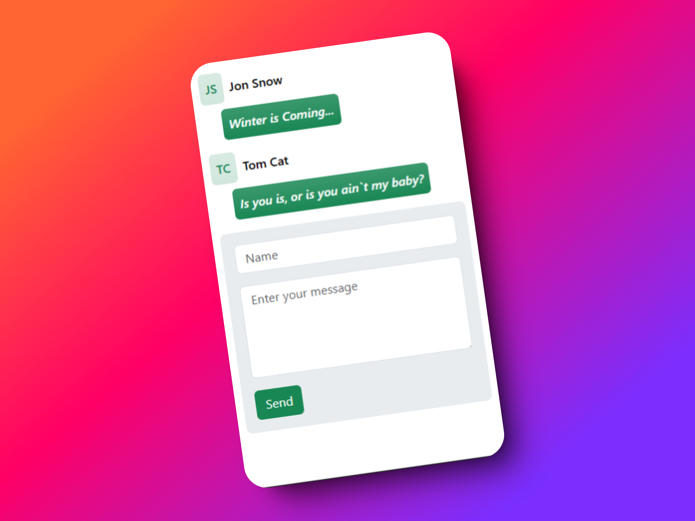

# Chat Application

This project is a simple chat application built using Node.js, Express, and Socket.io. It allows users to send and receive messages in real-time.



## Installation

1. Clone the repository:
   ```bash
   git clone https://github.com/yourusername/chat-app.git
   ```
2. Navigate to the project directory:

   ```powershell-interactive
    cd chat-app
   ```

3. Install the dependencies:

   ```powershell-interactive
    npm install
   ```

## Usage

1. Start the server
   ```bash
   node server.js
   ```
2. Open index.html in your browser to use the chat application.

## Project Structure

- server.js: Sets up the server and handles socket connections.

- app.js: Manages the client-side logic for sending and receiving messages.

**server.js**

```javascript
const express = require("express");
const app = express();
const http = require("http").Server(app);
const io = require("socket.io")(http);
const bodyParser = require("body-parser");

app.use(bodyParser.json());
app.use(express.static("public"));

let messages = [];

app.get("/messages", (req, res) => {
  res.send(messages);
});

app.post("/messages", (req, res) => {
  messages.push(req.body);
  io.emit("message", req.body);
  res.sendStatus(200);
});

io.on("connection", (socket) => {
  console.log("a user connected");
  socket.on("disconnect", () => {
    console.log("user disconnected");
  });
});

http.listen(3000, () => {
  console.log(`server is listening on port ${http.address().port}`);
});
```

**app.js**

```javascript
let socket = io();
document.addEventListener("DOMContentLoaded", function () {
  let sendButton = document.querySelector("#send");
  let nameInput = document.querySelector("#name");
  let messageInput = document.querySelector("#message");

  sendButton.addEventListener("click", () => {
    let message = {
      name: nameInput.value,
      message: messageInput.value,
    };
    postMessage(message);
  });
  getMessages();
});

socket.on("message", addMessage);

function addMessage(message) {
  let messageBox = document.querySelector("#messages");
  let messageContent = `
    <div class="d-flex flex-column text-white gap-2" >
      <div class="d-flex gap-2 align-items-center">
          <div class="bg-success-subtle bg-gradient text-success rounded w-auto h-auto p-2 fw-semibold">
            ${message.name.match(/\b\w/g).join("").toUpperCase()}
          </div>
          <span class="text-black fw-semibold fs-6">${message.name}</span>
        </div>
     <p class="rounded w-auto h-auto bg-success bg-gradient p-2 fw-semibold align-self-start ms-4 fst-italic">${
       message.message
     }</p>
    </div>
    `;
  messageBox.insertAdjacentHTML("beforeend", messageContent);
}

function getMessages() {
  let response = fetch("http://localhost:3000/messages");
  response.then((data) => data.json()).then((data) => data.forEach(addMessage));
}

function postMessage(message) {
  let response = fetch("http://localhost:3000/messages", {
    method: "POST",
    headers: {
      "Content-Type": "application/json",
    },
    body: JSON.stringify(message),
  });
  response
    .then((response) => {
      if (!response.ok) {
        throw new Error("HTTP error, status: " + response.status);
      }
      return response.json();
    })
    .then((data) => console.log(data))
    .catch((error) => console.error("Error:", error));
}
```

## License

```md
    Feel Free to contribute and use as this project is yet to obtain a valid license
```

---
